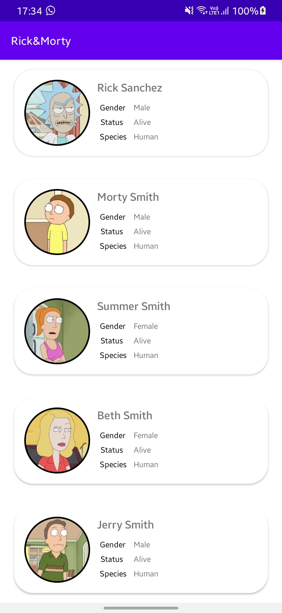
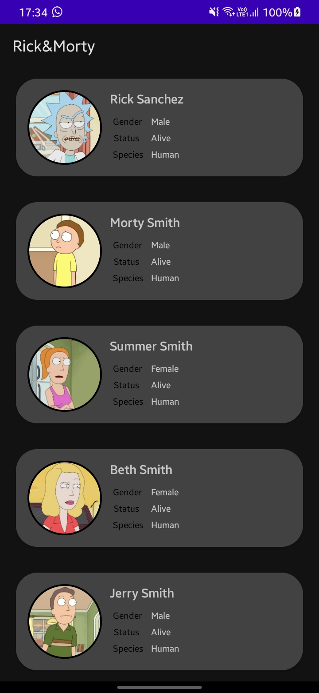

## Rick&Morty

- This application is an application to practise my MVVM skills. It simply displays a list of characters from the [Rick & Morty API](https://rickandmortyapi.com/documentation/).
- The application is built using the MVVM architecture.
## Dependencies
- [Glide](https://github.com/bumptech/glide)
- [Gson Converter](https://github.com/square/retrofit/tree/master/retrofit-converters/gson)
- [Retrofit](https://square.github.io/retrofit/)
- [ViewModel and LiveData](https://developer.android.com/jetpack/androidx/releases/lifecycle)
- [CircleImageView](https://github.com/hdodenhof/CircleImageView)
- [Hilt](https://developer.android.com/training/dependency-injection/hilt-android)
- [Coroutines](https://developer.android.com/kotlin/coroutines)
- [Coil](https://coil-kt.github.io/coil/)
## Screenshots

